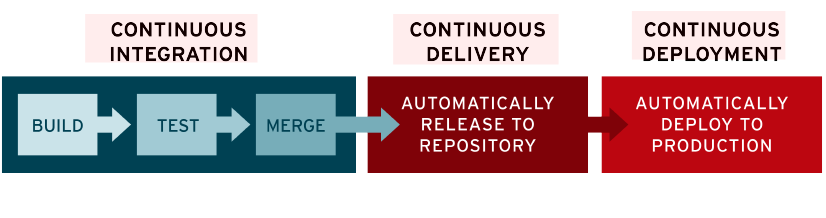

# CI/CD

애플리케이션의 통합 및 테스트 단계에서부터 제공 및 배포에 이르는 애플리케이션의 라이프사이클 전체에 걸쳐 지속적인 자동화와 지속적인 모니터링을 제공

## CI 
- Continuous Integration
- 애플리케이션에 대한 새로운 코드 변경 사항이 정기적으로 빌드 및 테스트되어 공유 코드 리포지토리(e.g. GitHub)에 통합
- 여러 명의 개발자가 동시에 애플리케이션 개발과 관련된 코드 작업을 할 경우 서로 충돌할 수 있는 문제를 해결

## CD
- Continuous Delivery
- 개발자들이 애플리케이션에 적용한 변경 사항이 버그 테스트를 거쳐 릴리즈용 리포지토리(e.g. container registry)에 자동으로 업로드되는 것
- 최소한의 노력으로 새로운 코드를 배포하는 것이 목표

## CD
- Continuous Deployment
- 개발자의 변경 사항을 리포지토리에서 고객이 사용 가능한 프로덕션 환경까지 자동으로 릴리스하는 것
- 애플리케이션 제공 속도를 저해하는 수동 프로세스로 인한 운영팀의 프로세스 과부하 문제를 해결

> ref. 
> - https://www.redhat.com/ko/topics/devops/what-is-ci-cd
