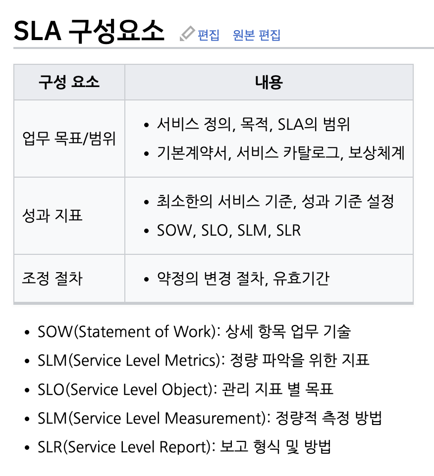
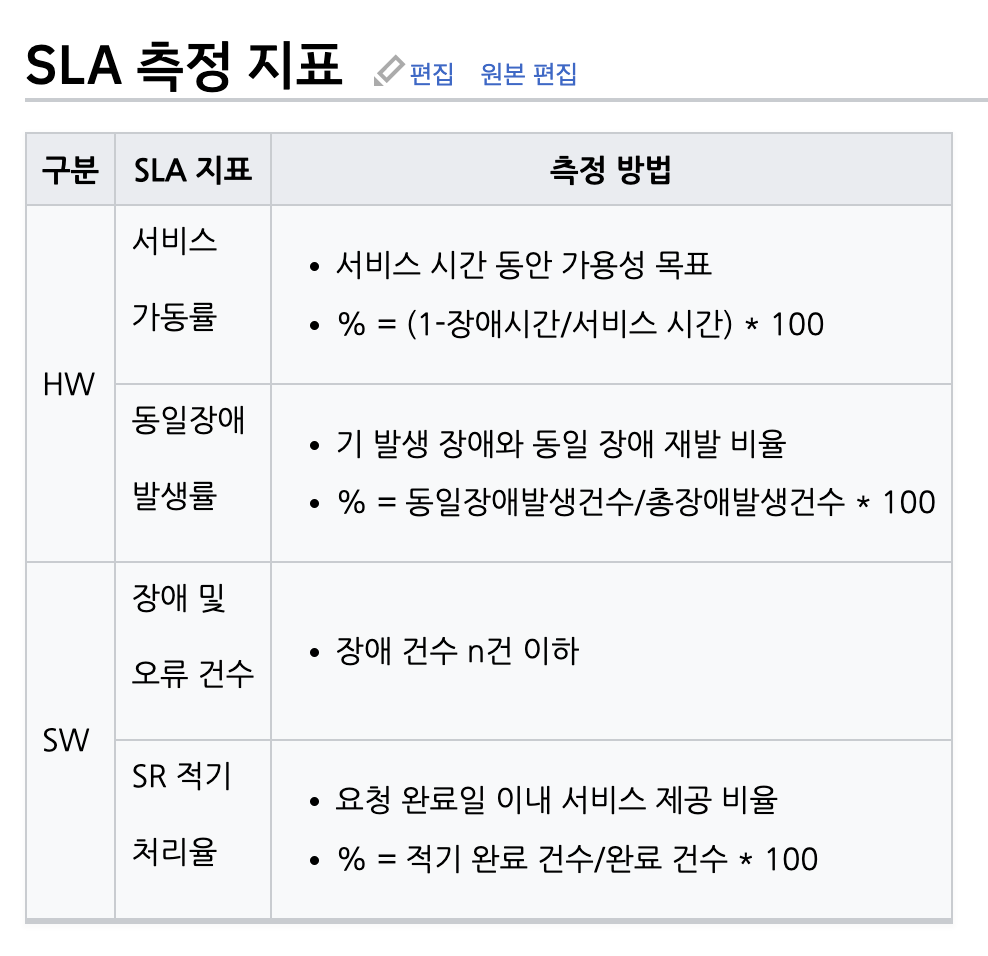

# SLA

## 정의
- Service Level Agreement
- 정보시스템 수요자와 공급자 사이의 상호 동의에 의하여 서비스 수준을 명시적으로 정의하고 이를 문서화한 약정서

## 필요성
- 서비스의 복잡도 증가에 따른 명확한 의사소통 필요
- 수요자와 공급자의 기대차이로 인한 객관적 기준 필요
- 서비스 측정과 계량화에 따른 성과측정 필요

## 구성 요소

## 측정 지표

## 목적 및 기대 효과
- 서비스 제공자 측면
  - 제공 서비스의 범위/기준 명확화
  - 향후 분쟁 발생시 조정을 위한 근거 자료로 활용
  - 고객(발주처)의 무리한 요구 제한 가능
- 사용자 측면
  - 서비스 발주에 대한 관리/성과측정 가능
  - 서비스 품질의 기본적 수준 보장 가능
  - 축적된 서비스 품질 자료로 재활용 가능
- 기대효과
  - 상호간 의사소통의 오해를 없애고 기대차이를 줄여 갈등 방지
  - 공급업체에 의해 제공되는 서비스 품질의 객관적 평가 가능
  - 시스템 자원 및 인원에 대한 적절한 통제 및 평가

> ref.
> - https://itwiki.kr/w/SLA
