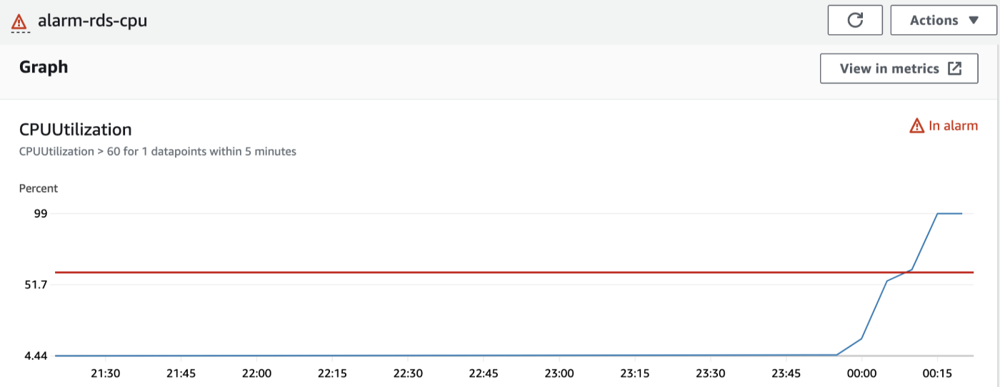
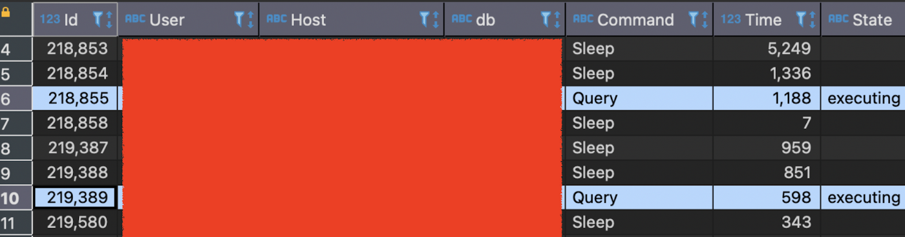

# You are not owner of thread

## AWS RDS CPU Utilization alarm occurred !!
인정한다. 물론, 최초부터 문제를 만들지 않으면 제일 최선이겠다만 (execution plan을 query 수행 전 매번 확인한다든지, 항상 index 관계를 염두에 두고 신중하게 query를 만든다든지, 등등..)

어찌 되었든 최선을 다해도 문제는 발생하기 마련이고,


끔찍한 문제가 발생

최소한 그 이야기를 동료 또는 고객이 아니라 시스템으로부터 들을 수 있도록 해두자.

## 범인 색출보다 환자 소생이 우선
이 악성 queries를 call한 진짜 범인(그게 사람이 되었든, 시스템이 되었든, ..)은 따로 있겠지만, 일단 그 범인 색출에 앞서 고통받는 우리 DB를 먼저 살려줘야겠다.

```sql
show full processlist;
```



악성 queries!
악성 질환을 찾았으면 제거해보도록 하자.

```sql
kill 218855;
```
잘 해결될 수도 있지만, 다음과 같은 에러 메시지를 볼 수도 있는데,

```sql
You are not owner of thread :P
```

AWS RDS에서는 아무리 admin (root) 계정이더라도 super privilege가 주어지지 않아 일부 시스템 프로시저, 특정 테이블 등에 대한 접근 권한이 제한되어 있고, 그래서 이 thread, 저 thread 직접 제거할 수 없다.

## 언제나 방법은 있다.
지난 번 parameter group 설정과 마찬가지로, 제한된 기능들도 어쨌든 가능하도록 다른 방법들이 구비되어 있어,

이렇게 세션을 끊든지

```sql
CALL mysql.rds_kill(218855);
```
이렇게 query만 죽이든지 하면 되겠다.

```sql
CALL mysql.rds_kill_query(218855);
```

이제 범인을 잡으러 가보자…

> References
> https://docs.aws.amazon.com/AmazonRDS/latest/UserGuide/Appendix.MySQL.CommonDBATasks.html#Appendix.MySQL.CommonDBATasks.End