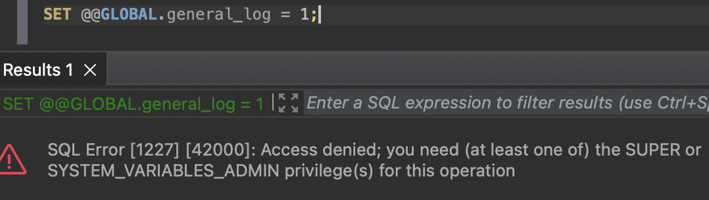
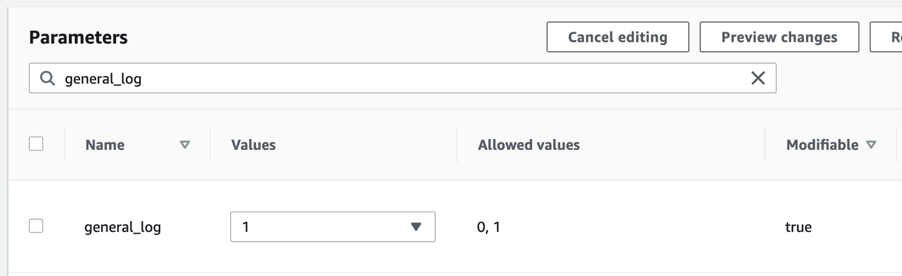
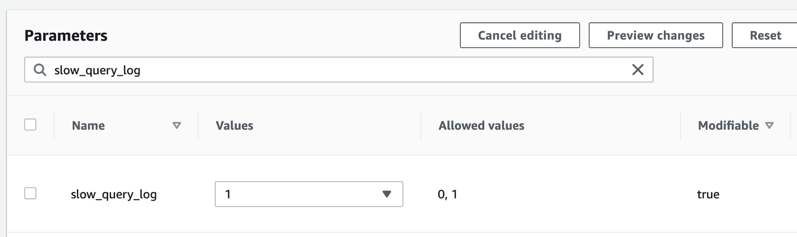
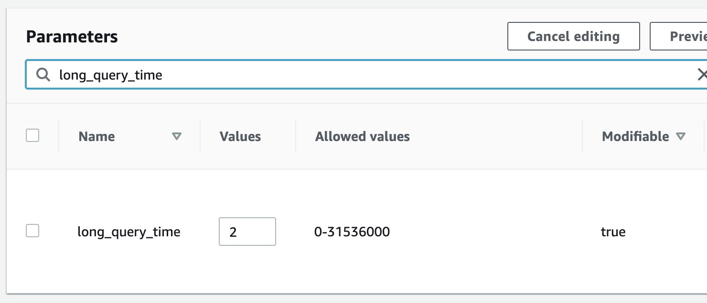
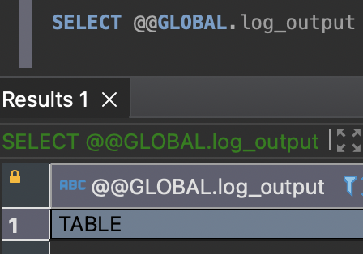

# list of queries executed on MySQL

데이터베이스에서 실제로 수행된 쿼리 기록을 보고 싶다.

## 로그 출력 여부

```sql
SELECT @@GLOBAL.general_log;
```

이게 켜져 있어야 확인해볼 수 있는데, 대개의 경우(as a default value) 꺼져 있다.

```sql
SET @@GLOBAL.general_log = 1;
```

AWS RDS에서는 admin 계정으로 상기 커맨드를 실행하더라도 권한이 막혀 있어, 다음과 같은 메시지를 보게 된다.



## Parameter groups

Modifiable이 true여야만 변경 가능

Parameter group을 만들어 원하는 값들을 몇 변경해주고, 적용을 희망하는 RDS instance에 해당 parameter group을 붙여주면 되겠다.

몇 가지만 더 적용하자.

slow_query도 보고 싶으니


2초로 지정

2초가 넘어가는 쿼리는 슬로우 쿼리로 정의하고, 기록을 남기도록 🐌

## 로그 출력 장소
```sql
SELECT @@GLOBAL.log_output
```


AWS RDS에서는 기본적으로 TABLE인 듯 하다.

이걸 FILE 로 변경할 수 있겠는데, 매번 브라우저로 AWS Management Console에 들어가서 확인하고 싶진 않으니 TABLE 로 두겠다.

## 로그 확인
```sql
SELECT * FROM mysql.general_log;
SELECT * FROM mysql.slow_log; 
```

잘 된다. 👍
흠, 그런데 이렇게 가끔 생각날 때마다 slow queries 슥- 훑어보고 점검하는 방식은 뭔가 너무 수동적인 것 같고,
- slow query가 발생하자마자 slack으로 notification을 주든지
- 주기적으로, 가령 이 달의 worst queries 목록 따위를 뽑아 email로 쏴주든지

했으면 좋겠다. 조금 더 고민해보자.

> References
> - https://aws.amazon.com/ko/premiumsupport/knowledge-center/rds-mysql-logs/
