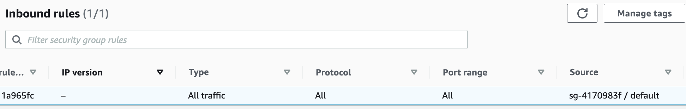

# security group

## warnings

1. default security group의 inbound rules
  source가 0.0.0.0/0인 게 아니다. 자칫 모두 허용해준다고 오인 금물.
   

2. security group을 security group의 source 또는 destination으로 사용할 때 private ip 기준으로 동작. 최소한 internet-facing alb의 security group에 대고 inbound rules에 다른 security group을 넣어줄 일은 없다는 이야기. 이 경우, security group 대신 public ip를 사용하든지, 또는 security group을 꼭 source로 써야겠으면 alb를 internal로 돌려야 한다.

    > The ID of a security group (referred to here as the specified security group). For example, the current security group, a security group from the same VPC, or a security group for a peered VPC. This allows traffic based on the **private IP addresses** of the resources associated with the specified security group. This does not add rules from the specified security group to the current security group.

    > references.
    > - https://docs.aws.amazon.com/vpc/latest/userguide/VPC_SecurityGroups.html#SecurityGroupRules
    